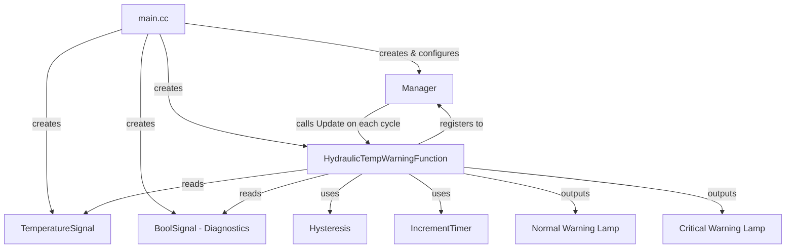
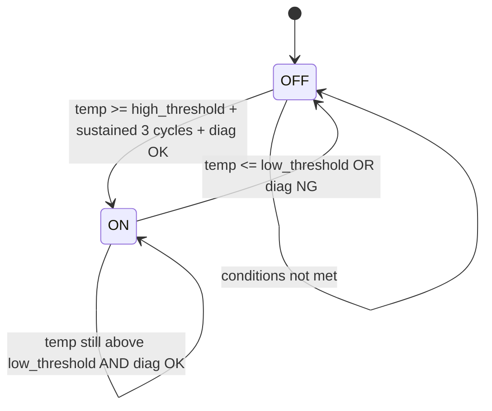
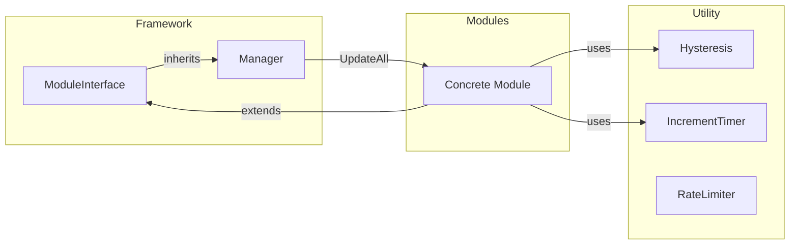

# Embedded Control Simulation

PC-based simulation of embedded control logic for **vehicle monitoring and engine management systems**. Demonstrates modular, extensible frameworks commonly used in automotive and industrial embedded software.

## Repository Structure

```
Embedded-Control-Simulation/
„¥„Ÿ„Ÿ vehicle_monitoring_system/      # ? Completed ? Hydraulic temp warning
„¥„Ÿ„Ÿ engine_management_system/       # ? In Progress ? Engine control modules
„¥„Ÿ„Ÿ embedded_study_journal.md       # Learning journal
„¤„Ÿ„Ÿ embedded_interview_cheatsheet.md # Interview prep notes
```

---

## Project 1: Vehicle Monitoring System ?

### Architecture



### Two-Level Alert System

| Level | Condition | Behavior |
|-------|-----------|----------|
| **Normal** | Temp >= 95 C for 3 consecutive cycles, diagnostics OK | Normal lamp ON |
| **Critical** | Temp >= 100 C, regardless of diagnostics | Critical lamp ON (forced) |

### State Machine (Normal Warning)



### Key Design Decisions

- **Hysteresis**: Uses separate high (95 C) and low (85 C) thresholds to prevent lamp flickering when temperature oscillates near a single threshold.
- **Debounce Timer**: Temperature must exceed the threshold for 3 consecutive cycles before triggering, filtering out sensor noise.
- **Fail-safe (Critical)**: When temperature reaches critical level (>= 100 C), the system forces the warning lamp ON regardless of diagnostic status, ensuring safety even during communication failure.
- **Signal Validity**: If input signals are invalid (e.g., sensor disconnected), the system turns off lamps and marks output as INVALID.

### Project Structure

```
vehicle_monitoring_system/
„¥„Ÿ„Ÿ CMakeLists.txt
„¥„Ÿ„Ÿ main.cc                              # Entry point, test simulation
„¤„Ÿ„Ÿ src/
    „¥„Ÿ„Ÿ framework/
    „    „¥„Ÿ„Ÿ module_interface.h           # Abstract base class (pure virtual Update)
    „    „¤„Ÿ„Ÿ manager.h                    # Module scheduler (register + UpdateAll)
    „¥„Ÿ„Ÿ modules/
    „    „¥„Ÿ„Ÿ hydraulic_temp_warning_module.h   # Hydraulic oil temperature warning
    „    „¤„Ÿ„Ÿ hydraulic_temp_warning_module.cc  # Implementation
    „¥„Ÿ„Ÿ signals/
    „    „¤„Ÿ„Ÿ signals.h                    # Signal template class with validity
    „¤„Ÿ„Ÿ utility/
        „¥„Ÿ„Ÿ hysteresis.h                 # Hysteresis comparator (reusable)
        „¤„Ÿ„Ÿ increment_timer.h            # Debounce timer (reusable)
```

### Build & Run

```bash
cd vehicle_monitoring_system
mkdir build && cd build
cmake ..
cmake --build .
.\Debug\vehicle_monitoring_system.exe   # Windows
```

---

## Project 2: Engine Management System ?

An independent rewrite of the framework + utility + signals layer, plus engine-specific modules. Written from scratch as a learning exercise.

### Current Status (2026.06.01)

| Layer | File | Status |
|-------|------|--------|
| framework | module_interface.h | ? Done |
| framework | manager.h | ? Done |
| signals | signals.h | ? Done |
| utility | increment_timer.h | ? Done |
| utility | hysteresis.h | ? Done (has known issues) |
| utility | RateLimiter.h | ? In Progress |
| modules | (TBD) | ? Not Started |
| ? | main.cc | ? Not Started |

### Planned Modules

- **Coolant Temperature Warning** ? Hysteresis + Timer, similar to vehicle project
- **Engine RPM Monitor** ? Overspeed / idle detection
- **Fuel Pressure Monitor** ? Low pressure alert with debounce

### Project Structure

```
engine_management_system/
„¥„Ÿ„Ÿ CMakeLists.txt
„¥„Ÿ„Ÿ main.cc                              # (empty, to be written)
„¥„Ÿ„Ÿ study_plan.md                        # Detailed progress & learning notes
„¤„Ÿ„Ÿ src/
    „¥„Ÿ„Ÿ framework/
    „    „¥„Ÿ„Ÿ module_interface.h           # ? Interface base class
    „    „¤„Ÿ„Ÿ manager.h                    # ? Module scheduler
    „¥„Ÿ„Ÿ signals/
    „    „¤„Ÿ„Ÿ signals.h                    # ? Signal template + typedef aliases
    „¥„Ÿ„Ÿ utility/
    „    „¥„Ÿ„Ÿ hysteresis.h                 # ? Hysteresis comparator
    „    „¥„Ÿ„Ÿ increment_timer.h            # ? Increment timer (no-arg Update)
    „    „¤„Ÿ„Ÿ RateLimiter.h                # ? Rate limiter (in progress)
    „¤„Ÿ„Ÿ modules/                         # ? Engine-specific modules (TBD)
```

---

## Shared Framework Pattern

Both projects follow the same architecture:



## Future Plans

- **Arduino Port**: Migrate logic to real hardware with ADC temperature sensing, GPIO LED control, and timer interrupts for scheduling.
- **FreeRTOS Integration**: Multi-task architecture with separate tasks for sensor reading, warning logic, and display.
- **CAN Bus Communication**: Multi-ECU communication framework for vehicle-wide data exchange.
